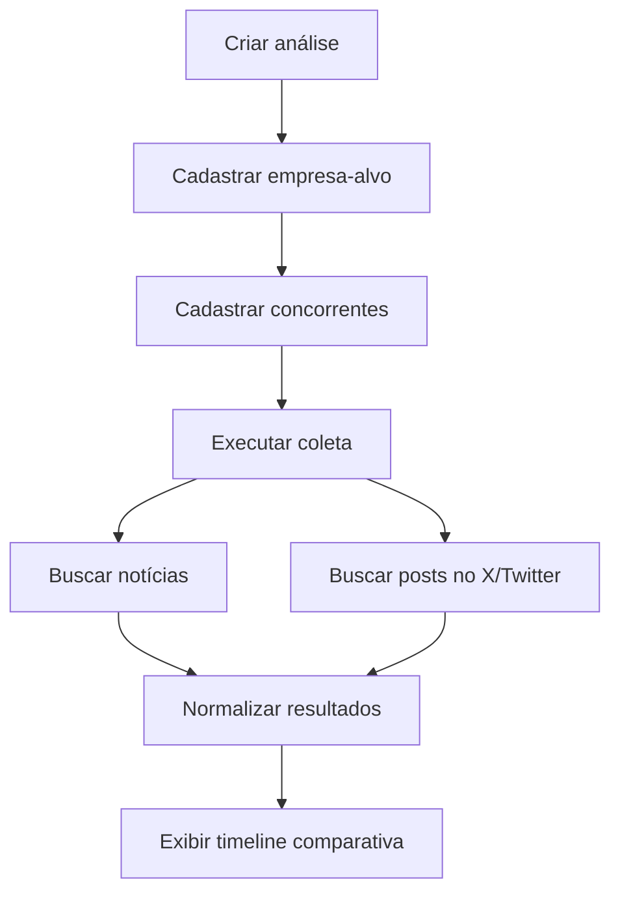
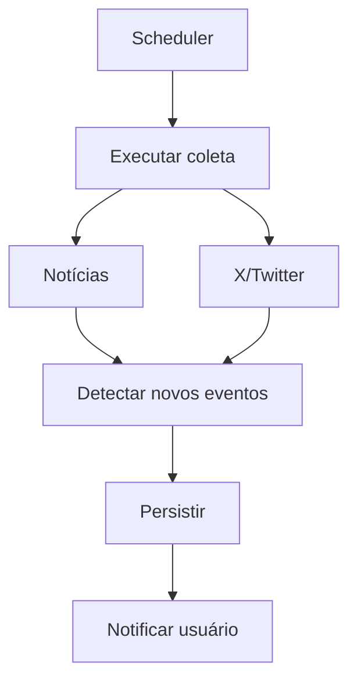

# Competitive Monitor — Proposta de MVP e Organização do Projeto

Este documento registra a **visão do produto, as decisões de escopo, o roadmap e a organização inicial do projeto**. Seu papel é estratégico: explicar o problema, o recorte do MVP e as possibilidades de evolução.

A referência oficial para **modelo de dados, endpoints, tecnologias, usuários e fluxos do MVP** é [docs/arquitetura.md](docs/arquitetura.md), documento da entrega de arquitetura da Aula 1. Os detalhes técnicos são mantidos nessa referência, evitando contratos duplicados aqui.

Referências do projeto:

- [Arquitetura oficial — Aula 1](docs/arquitetura.md).
- [Registro dos prompts de arquitetura — Aula 1](prompts/prompt_architecture.md).
- [Prompt de geração de contexto — Aula 2](prompts/context-generation.md).
- [Prompt de implementação — Aula 2](prompts/implementation.md).

A base técnica do backend já existe; as funcionalidades de negócio e o frontend ainda serão implementados. O planejamento abaixo não deve ser interpretado como registro de funcionalidades entregues.

## 1. Objetivo do projeto

Desenvolver um **MVP de monitoramento competitivo de empresas**, capaz de centralizar acontecimentos recentes relacionados a uma empresa-alvo e seus concorrentes.

A proposta é começar com um escopo pequeno e demonstrável, focado principalmente em:

- Notícias;
- Publicações no X/Twitter;
- Perfil básico manual e opcional das empresas;
- Comparação entre empresa-alvo e concorrentes;
- Visualização dos acontecimentos em uma timeline única.

A arquitetura deverá permitir a evolução futura para uma plataforma mais completa de **Competitive Intelligence**, sem exigir que todas essas funcionalidades estejam presentes no MVP.

---

# 2. Visão do produto

## MVP

O usuário cria uma análise competitiva informando:

- Empresa-alvo;
- Site da empresa;
- Concorrentes que deseja acompanhar;
- Opcionalmente, termo de busca e perfil básico de cada empresa.

O analista aciona a coleta de acontecimentos recentes das empresas configuradas e consulta os resultados de forma consolidada. O perfil básico é opcional e não condiciona a coleta.

Fluxo principal:



---

# 3. Funcionalidades do MVP

## 3.1 Criar análise

O usuário poderá criar uma análise contendo:

- Nome da análise;
- Empresa-alvo;
- Site da empresa;
- Lista de concorrentes.

Exemplo:

```text
Análise: Bancos Digitais Brasil

Empresa-alvo:
Nubank

Concorrentes:
- Inter
- C6 Bank
- PicPay
```

Neste primeiro momento, **os concorrentes serão informados manualmente pelo usuário**.

Os concorrentes podem ser adicionados ou removidos depois da criação da análise. Para demonstrar o fluxo completo do MVP, deve haver ao menos um concorrente.

A descoberta automática de concorrentes ficará para versões futuras.

---

## 3.2 Cadastro de empresas

Cada empresa é cadastrada com nome e site. `Company` representa a empresa; o papel de empresa-alvo (`TARGET`) ou concorrente (`COMPETITOR`) pertence a `AnalysisCompany.role`, dentro de cada análise. Assim, a mesma empresa pode assumir papéis diferentes em análises distintas.

O **perfil básico manual faz parte do MVP**, com os campos opcionais:

- Mercado;
- Produtos;
- Público-alvo.

O analista pode preencher e editar esse perfil para contextualizar a comparação. A coleta funciona mesmo sem o perfil. A geração automática e o enriquecimento do perfil ficam para versões futuras.

O cadastro também permite um termo de busca opcional, `search_term`, cujo padrão é o nome da empresa. O modelo detalhado está na [arquitetura oficial](docs/arquitetura.md).

---

## 3.3 Coleta de notícias

O sistema deverá consultar uma fonte externa de notícias, inicialmente utilizando a **GNews API** ou um provider equivalente.

As pesquisas serão realizadas usando o `search_term` da empresa ou, quando não informado, seu nome. Isso permite buscar “Banco Inter” em vez do nome ambíguo “Inter”.

Exemplo:

```text
"Nubank"
"Banco Inter"
"C6 Bank"
"PicPay"
```

Os resultados serão convertidos para um formato comum da aplicação.

---

## 3.4 Coleta de publicações no X/Twitter

A arquitetura deverá prever uma segunda fonte de informação para publicações no X/Twitter.

A implementação poderá utilizar:

- **X Provider** com API oficial, caso seja viável;
- **Mock Provider** com dados simulados, caso existam limitações de autenticação, custo ou disponibilidade.

O MVP não depende da API do X para funcionar. Eventos mockados são identificados por `is_mock` e devem ser reconhecíveis na apresentação dos resultados.

A coleta mantém a deduplicação básica de eventos. Se um provider falhar, as demais fontes continuam, com indicação do status de cada fonte. As regras técnicas estão na [arquitetura oficial](docs/arquitetura.md).

---

## 3.5 Timeline competitiva

A principal visualização do sistema será uma timeline comparativa consolidada das empresas vinculadas à análise.

Exemplo ilustrativo, com acontecimentos fictícios. O período padrão de 7 dias ainda depende de confirmação do grupo:

```text
Competitive Monitor

Análise: Bancos Digitais Brasil
Período: últimos 7 dias

------------------------------------------------

INTER
Fonte: NOTÍCIA

Inter anuncia novo produto de investimentos.

21/09/2026

------------------------------------------------

NUBANK
Fonte: X

@nubank anuncia nova funcionalidade no aplicativo.

20/09/2026

------------------------------------------------

C6 BANK
Fonte: NOTÍCIA

C6 anuncia alteração em produto financeiro.

19/09/2026
```

Filtros previstos:

- Empresa;
- Fonte;
- Período.

---

# 4. Escopo que NÃO faz parte do MVP

As funcionalidades abaixo **não fazem parte do MVP**. Algumas representam possibilidades de evolução futura:

- Mapa Competitivo;
- Crawling completo do site da empresa;
- Geração automática do perfil da empresa (no MVP, o perfil básico é preenchido manualmente);
- Descoberta automática de concorrentes;
- Deduplicação inteligente de empresas;
- Classificação de concorrentes como:
  - Diretos;
  - Indiretos;
  - Substitutos;
  - Emergentes;
- Score de confiança;
- Justificativa automática de concorrência;
- Análise por IA, incluindo análise de tese de investimento;
- Classificação automática de impacto;
- Alertas e notificações;
- Histórico avançado de decisões;
- Processamento contínuo em background.

O MVP possui apenas o perfil funcional de **Analista**. Autenticação, autorização e múltiplos níveis de acesso estão fora do escopo.

O objetivo é garantir que o MVP seja **pequeno, implementável e demonstrável**.

---

# 5. Roadmap de evolução

## V1 — MVP

```text
Empresa-alvo
      ↓
Concorrentes definidos manualmente
      ↓
Perfil básico manual (opcional)
      ↓
Notícias + X/Twitter (providers reais ou mockados)
      ↓
Timeline comparativa
```

---

## V2 — Enriquecimento automático do perfil

Evoluir o perfil manual já disponível na V1 com análise do site oficial e extração automática de informações, sujeitas à revisão do analista. Esta versão acrescenta automação e enriquecimento, não a existência do perfil.

Informações possíveis:

- Mercado;
- Produtos;
- Público-alvo;
- Modelo de negócio;
- Posicionamento;
- Geografias de atuação.

Fluxo:

```text
Empresa
   ↓
Site oficial
   ↓
Extração de informações
   ↓
Perfil sugerido
   ↓
Validação pelo analista
```

---

## V3 — Descoberta/classificação de concorrentes

Nesta evolução futura, o sistema poderá utilizar o perfil enriquecido e revisado pelo analista para pesquisar e classificar possíveis concorrentes. A confirmação de perfil não é requisito da V1.

Fluxo:

```text
Perfil da empresa
      ↓
Geração de consultas
      ↓
Pesquisa de empresas
      ↓
Candidatos a concorrentes
      ↓
Classificação
      ↓
Validação pelo analista
```

Possíveis classificações:

- Concorrente direto;
- Concorrente indireto;
- Substituto;
- Emergente.

---

## V4 — Inteligência competitiva com IA

A evolução seguinte poderá utilizar modelos de linguagem para enriquecer os eventos já normalizados no MVP com resumos, categorias e avaliação de impacto.

Exemplo:

```text
Empresa:
Inter

Categoria:
PRODUCT_LAUNCH

Resumo:
Empresa anunciou uma nova modalidade de investimento.

Impacto potencial:
Expansão da oferta para investidores pessoa física.

Confiança:
87%

Evidências:
- Notícia X
- Post Y
```

---

## V5 — Monitoramento contínuo e alertas

Adicionar processamento periódico, detecção de novos acontecimentos e alertas. Na V1, a coleta permanece acionada manualmente.



---

# 6. Diretriz de arquitetura

A solução combina uma aplicação web, backend REST, banco de dados e providers de fontes externas. Essa separação permite evoluir as integrações sem concentrar suas particularidades na interface ou nas regras do produto.

O diagrama de componentes e as tecnologias confirmadas estão na [arquitetura oficial](docs/arquitetura.md). O framework de frontend permanece a definir pelo grupo.

---

# 7. Conceitos principais do domínio

- **Analysis:** organiza uma análise competitiva.
- **Company:** representa uma empresa, incluindo seu perfil básico manual e termo de busca.
- **AnalysisCompany:** vincula empresa e análise; seu `role` determina `TARGET` ou `COMPETITOR` naquele contexto.
- **Event:** representa um acontecimento coletado para uma empresa, com identificação da fonte e de dados mockados.

Os atributos, chaves e regras de persistência são definidos na [arquitetura oficial](docs/arquitetura.md).

---

# 8. Relações entre os conceitos

Uma análise reúne uma empresa-alvo e seus concorrentes por meio dos vínculos de participação. Uma empresa pode participar de várias análises e reunir vários eventos. O papel da empresa depende de cada vínculo, não de uma classificação fixa da empresa.

O diagrama de entidades e relacionamentos é mantido em [docs/arquitetura.md](docs/arquitetura.md).

---

# 9. Capacidades da API

A API dará suporte à criação e consulta de análises, à manutenção de concorrentes e perfis, à execução da coleta e à consulta dos eventos com filtros.

A lista oficial de endpoints está em [docs/arquitetura.md](docs/arquitetura.md). Este documento não mantém uma segunda definição dos contratos REST.

---

# 10. Jornada de coleta e consulta

O analista seleciona as empresas da análise, ajusta seus termos de busca e aciona a coleta. O sistema consulta os providers, normaliza e persiste os resultados sem duplicações básicas e apresenta os acontecimentos na timeline.

Eventos mockados permanecem identificados. Uma falha de fonte não impede o aproveitamento dos resultados das demais; o analista recebe a indicação do status de cada fonte. O perfil manual continua opcional.

Os fluxos técnicos e as regras de coleta estão na [arquitetura oficial](docs/arquitetura.md).

---

# 11. Estrutura esperada do repositório

A estrutura final poderá seguir aproximadamente:

```text
competitive-monitor/
│
├── .ai/
│   ├── standards.md
│   ├── architecture.md
│   ├── tech-stack.md
│   └── business-rules.md
│
├── docs/
│   └── arquitetura.md
│
├── prompts/
│   ├── prompt_architecture.md
│   ├── context-generation.md
│   └── implementation.md
│
├── backend/
│
├── frontend/
│
└── README.md
```

---

# 12. Divisão sugerida do grupo

A divisão abaixo busca permitir trabalho paralelo sem criar quatro projetos independentes.

---

## — Produto, arquitetura e documentação

Responsabilidades principais:

- Consolidar o escopo do MVP;
- Garantir que funcionalidades fora do MVP não entrem no desenvolvimento;
- Estruturar o documento de arquitetura;
- Criar/revisar:
  - Diagrama de arquitetura;
  - Diagrama de entidades;
  - Fluxos principais;
- Consolidar regras de negócio;
- Ajudar na validação funcional do sistema.

Entregas principais:

```text
docs/arquitetura.md
.ai/business-rules.md
Diagramas Mermaid
```

Após a conclusão da documentação inicial, poderá apoiar os testes e ajustes do sistema.

---

## — Frontend

Responsabilidades principais:

- Estruturar o frontend;
- Criar tela de listagem de análises;
- Criar formulário para nova análise;
- Criar cadastro e remoção de concorrentes;
- Permitir edição do perfil básico manual e do termo de busca;
- Criar página de visualização de uma análise;
- Implementar timeline;
- Implementar filtros por empresa, fonte e período;
- Integrar frontend com backend.

Entregas principais:

```text
frontend/
```

Fluxos prioritários:

```text
Criar análise
      ↓
Adicionar concorrentes
      ↓
Executar coleta
      ↓
Visualizar timeline
```

---

## — Backend e banco de dados

Responsabilidades principais:

- Estruturar aplicação backend;
- Criar modelos de dados;
- Configurar banco;
- Implementar entidades:
  - Analysis;
  - Company;
  - AnalysisCompany;
  - Event;
- Criar endpoints REST;
- Implementar persistência;
- Implementar fluxo de coleta;
- Integrar backend com camada de providers.

Entregas principais:

```text
backend/
```

Priorizar os fluxos de análise, manutenção de empresas e perfil, coleta e timeline, seguindo os endpoints definidos em [docs/arquitetura.md](docs/arquitetura.md).

---

## — Integrações, contexto para IA e entrega técnica

Responsabilidades principais:

- Implementar camada `SourceProvider`;
- Implementar `GNewsProvider` ou equivalente;
- Avaliar viabilidade do `XProvider`;
- Criar `MockXProvider` caso necessário;
- Normalizar dados recebidos das fontes externas;
- Consolidar os arquivos de contexto utilizados pelos agentes;
- Organizar prompts utilizados;
- Apoiar README e preparação da demonstração.

Entregas principais:

```text
Camada de providers no backend (organização a definir na implementação)
.ai/
prompts/
README.md
```

Observação:

Os arquivos `.ai/` deverão ser revisados pelo grupo. Aqui o responsável terá que consolidar o material, e não por definir sozinho toda a arquitetura.

---

# 13. Responsabilidades compartilhadas

Algumas atividades deverão ser feitas em conjunto. As listas abaixo preservam a organização inicial do trabalho; não constituem um registro atualizado de execução.

## Definição

- [ ] Aprovar escopo final do MVP;
- [ ] Definir o framework do frontend e revisar as tecnologias já confirmadas na arquitetura;
- [ ] Escolher cenário utilizado na demonstração;
- [ ] Aprovar entidades;
- [ ] Aprovar endpoints.

## Contexto para IA

- [ ] Revisar `.ai/standards.md`;
- [ ] Revisar `.ai/architecture.md`;
- [ ] Revisar `.ai/tech-stack.md`;
- [ ] Revisar `.ai/business-rules.md`.

## Finalização

- [ ] Testar fluxo completo;
- [ ] Corrigir bugs;
- [ ] Revisar documentação;
- [ ] Garantir que repositório esteja público;
- [ ] Preparar dados de demonstração;
- [ ] Gravar vídeo;
- [ ] Revisar entregáveis.

---

# 14. Checklist de planejamento

As fases organizam as entregas do projeto. A base do backend já foi iniciada; os itens não assinalados não significam necessariamente ausência de trabalho realizado. O estado técnico atual deve ser consultado na arquitetura oficial e no README.

## Fase 1 — Definição

- [ ] Definir nome definitivo do projeto;
- [ ] Fechar escopo do MVP;
- [ ] Definir o framework do frontend e revisar as tecnologias já confirmadas na arquitetura;
- [ ] Definir entidades;
- [ ] Definir endpoints;
- [ ] Criar diagrama de arquitetura;
- [ ] Criar diagrama ER;
- [ ] Definir fluxo principal.

---

## Fase 2 — Contexto para IA

- [ ] Criar `.ai/standards.md`;
- [ ] Criar `.ai/architecture.md`;
- [ ] Criar `.ai/tech-stack.md`;
- [ ] Criar `.ai/business-rules.md`;
- [ ] Criar prompt de geração de contexto;
- [ ] Criar prompt de implementação;
- [ ] Registrar ferramentas utilizadas.

---

## Fase 3 — Backend

- [ ] Criar projeto backend;
- [ ] Configurar banco;
- [ ] Implementar `Analysis`;
- [ ] Implementar `Company`;
- [ ] Implementar `AnalysisCompany`;
- [ ] Implementar `Event`;
- [ ] Implementar endpoints REST;
- [ ] Implementar fluxo de coleta.

---

## Fase 4 — Integrações

- [ ] Definir interface `SourceProvider`;
- [ ] Implementar `GNewsProvider` ou equivalente;
- [ ] Testar consultas;
- [ ] Avaliar API do X;
- [ ] Implementar `XProvider` ou `MockXProvider`;
- [ ] Normalizar resultados;
- [ ] Persistir eventos.

---

## Fase 5 — Frontend

- [ ] Tela de análises;
- [ ] Criar análise;
- [ ] Cadastrar e remover concorrentes;
- [ ] Editar perfil básico manual e termo de busca;
- [ ] Página da análise;
- [ ] Botão para executar coleta;
- [ ] Timeline;
- [ ] Filtro por empresa;
- [ ] Filtro por fonte;
- [ ] Filtro por período;
- [ ] Identificar eventos mockados;
- [ ] Integração com backend.

---

## Fase 6 — Integração

- [ ] Testar criação da análise;
- [ ] Testar cadastro de concorrentes;
- [ ] Testar coleta;
- [ ] Testar persistência;
- [ ] Testar timeline;
- [ ] Tratar estados vazios;
- [ ] Tratar falhas parciais dos providers;
- [ ] Validar deduplicação básica;
- [ ] Confirmar coleta com perfil não preenchido.

---

## Fase 7 — Entrega

- [ ] Revisar documento de arquitetura;
- [ ] Conferir diretório `.ai/`;
- [ ] Conferir prompts;
- [ ] Criar README;
- [ ] Definir cenário da demo;
- [ ] Criar dados de demonstração;
- [ ] Publicar repositório;
- [ ] Gravar vídeo de 3 a 10 minutos;
- [ ] Revisar entregáveis finais.

---

# 15. Sugestão de cenário para demonstração

Para evitar uma demonstração genérica, utilizar um mercado conhecido com concorrentes fáceis de identificar.

Exemplo:

```text
Análise:
Bancos Digitais Brasil

Empresa-alvo:
Nubank

Concorrentes:
- Inter
- C6 Bank
- PicPay
```

Fluxo da demonstração:

1. Apresentar rapidamente o problema;
2. Mostrar criação da análise;
3. Mostrar empresa-alvo;
4. Adicionar concorrentes;
5. Mostrar o perfil básico manual opcional e o termo de busca;
6. Executar coleta;
7. Mostrar notícias e publicações, identificando os eventos mockados;
8. Mostrar a timeline comparativa e filtrar por concorrente;
9. Explicar rapidamente a arquitetura;
10. Apresentar a evolução futura.

---

# 16. Mensagem principal do projeto

O objetivo desta primeira versão não é construir toda uma plataforma de inteligência competitiva.

O MVP deverá provar o seguinte conceito:

> **É possível acompanhar uma empresa e seus concorrentes em uma única interface, consolidando acontecimentos recentes provenientes de diferentes fontes públicas.**

A demonstração deve atender ao critério de aceite da arquitetura oficial: criar uma análise, informar empresa-alvo e ao menos um concorrente, executar coleta real ou mockada, persistir eventos e consultar a timeline.

A partir dessa base, o produto poderá evoluir para enriquecimento automático do perfil, descoberta/classificação de concorrentes, análise com IA e monitoramento contínuo com alertas.

Esse recorte permite entregar um sistema pequeno e funcional, ao mesmo tempo em que apresenta uma visão clara de evolução para um produto mais completo.
