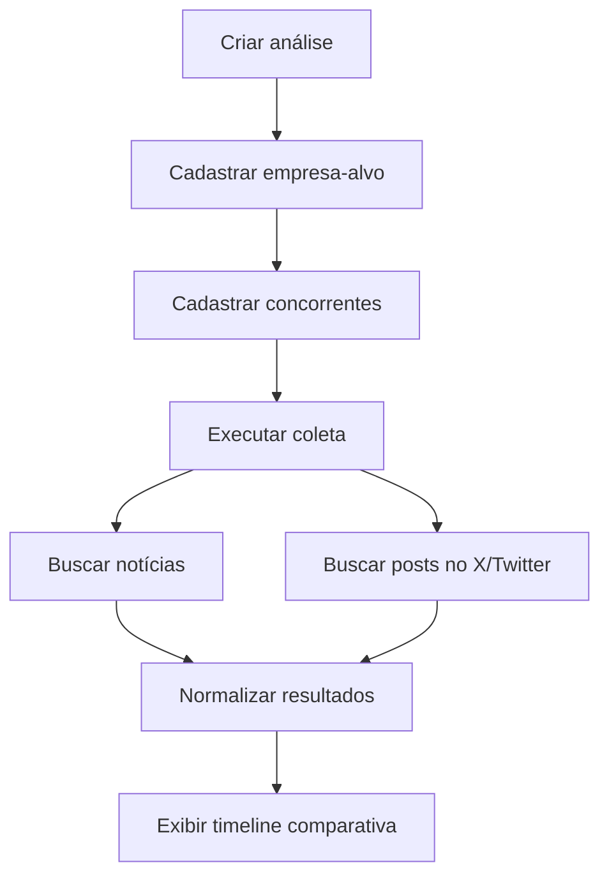
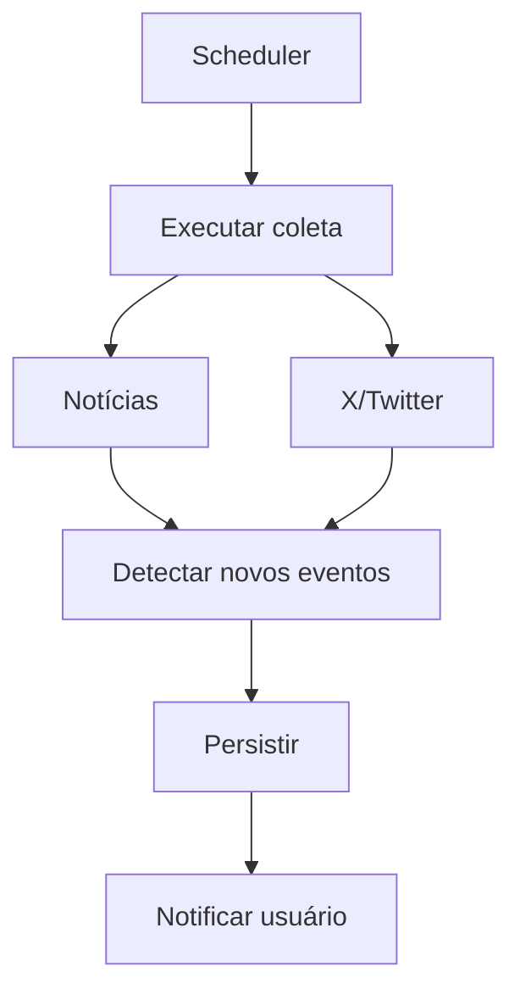
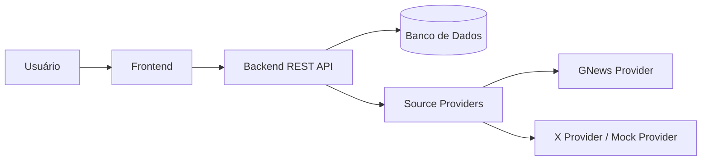
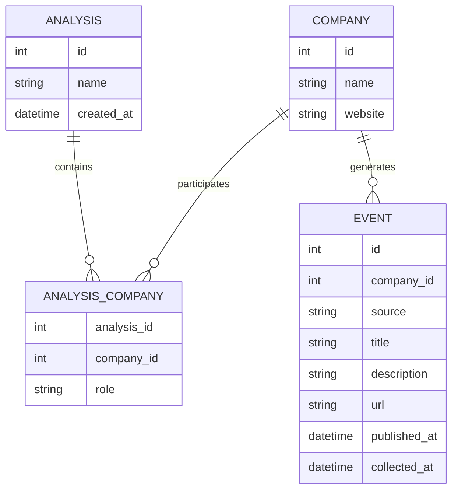
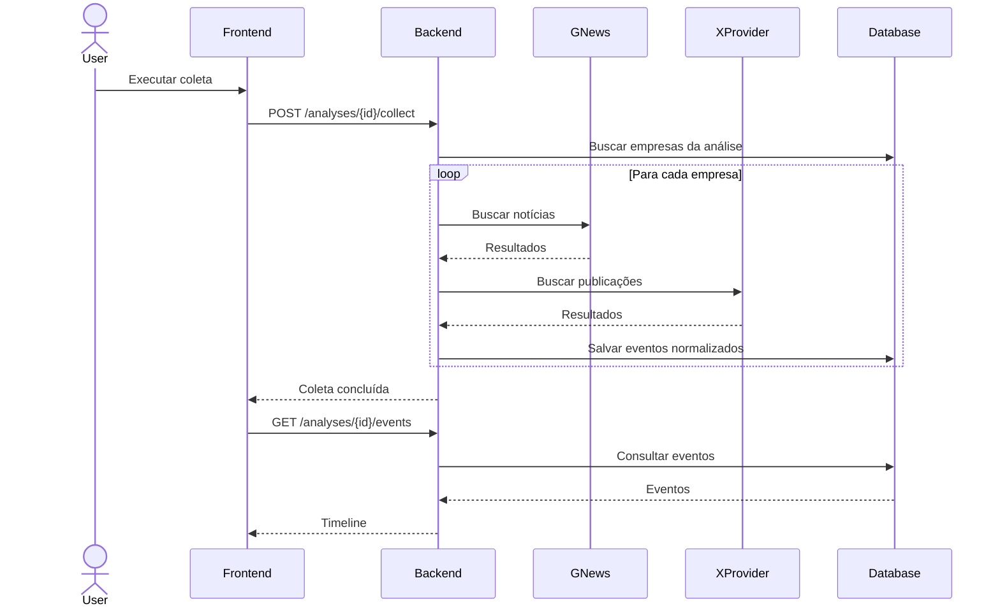

# Competitive Monitor — Proposta de MVP e Organização do Projeto

## 1. Objetivo do projeto

Desenvolver um **MVP de monitoramento competitivo de empresas**, capaz de centralizar acontecimentos recentes relacionados a uma empresa-alvo e seus concorrentes.

A proposta é começar com um escopo pequeno e demonstrável, focado principalmente em:

- Notícias;
- Publicações no X/Twitter;
- Comparação entre empresa-alvo e concorrentes;
- Visualização dos acontecimentos em uma timeline única.

A arquitetura deverá permitir a evolução futura para uma plataforma mais completa de **Competitive Intelligence**, sem exigir que todas essas funcionalidades estejam presentes no MVP.

---

# 2. Visão do produto

## MVP

O usuário cria uma análise competitiva informando:

- Empresa-alvo;
- Site da empresa;
- Concorrentes que deseja acompanhar.

O sistema coleta acontecimentos recentes relacionados às empresas configuradas e apresenta os resultados de forma consolidada.

Fluxo principal:



---

# 3. Funcionalidades do MVP

## 3.1 Criar análise

O usuário poderá criar uma análise contendo:

- Nome da análise;
- Empresa-alvo;
- Site da empresa;
- Lista de concorrentes.

Exemplo:

```text
Análise: Bancos Digitais Brasil

Empresa-alvo:
Nubank

Concorrentes:
- Inter
- C6 Bank
- PicPay
```

Neste primeiro momento, **os concorrentes serão informados manualmente pelo usuário**.

A descoberta automática de concorrentes ficará para versões futuras.

---

## 3.2 Cadastro de empresas

Cada empresa deverá possuir inicialmente:

```text
Company

- id
- name
- website
- type
```

Tipos:

```text
TARGET
COMPETITOR
```

---

## 3.3 Coleta de notícias

O sistema deverá consultar uma fonte externa de notícias, inicialmente utilizando a **GNews API** ou um provider equivalente.

As pesquisas serão realizadas utilizando o nome da empresa.

Exemplo:

```text
"Nubank"
"Banco Inter"
"C6 Bank"
"PicPay"
```

Os resultados serão convertidos para um formato comum da aplicação.

---

## 3.4 Coleta de publicações no X/Twitter

A arquitetura deverá prever uma segunda fonte de informação para publicações no X/Twitter.

A implementação poderá utilizar:

- API oficial do X, caso seja viável;
- Dados mockados, caso existam limitações de autenticação, custo ou disponibilidade.

O objetivo do MVP não é depender da API do X para funcionar.

---

## 3.5 Timeline competitiva

A principal visualização do sistema será uma timeline consolidada.

Exemplo:

```text
Competitive Monitor

Análise: Bancos Digitais Brasil
Período: últimos 7 dias

------------------------------------------------

INTER
Fonte: NOTÍCIA

Inter anuncia novo produto de investimentos.

21/09/2026

------------------------------------------------

NUBANK
Fonte: X

@nubank anuncia nova funcionalidade no aplicativo.

20/09/2026

------------------------------------------------

C6 BANK
Fonte: NOTÍCIA

C6 anuncia alteração em produto financeiro.

19/09/2026
```

Filtros desejáveis:

- Empresa;
- Fonte;
- Período.

---

# 4. Escopo que NÃO faz parte do MVP

As funcionalidades abaixo representam a evolução natural do produto, mas **não precisam ser implementadas na primeira versão**:

- Crawling completo do site da empresa;
- Geração automática do perfil da empresa;
- Descoberta automática de concorrentes;
- Deduplicação inteligente de empresas;
- Classificação de concorrentes como:
  - Diretos;
  - Indiretos;
  - Substitutos;
  - Emergentes;
- Score de confiança;
- Justificativa automática de concorrência;
- Análise de tese de investimento;
- Classificação automática de impacto;
- Alertas e notificações;
- Histórico avançado de decisões;
- Processamento contínuo em background.

O objetivo é garantir que o MVP seja **pequeno, implementável e demonstrável**.

---

# 5. Roadmap de evolução

## Versão 1 — MVP

```text
Empresa-alvo
      ↓
Concorrentes definidos manualmente
      ↓
Notícias + X/Twitter
      ↓
Timeline comparativa
```

---

## Versão 2 — Perfil competitivo

Adicionar coleta e análise do site oficial das empresas.

Informações possíveis:

- Mercado;
- Produtos;
- Público-alvo;
- Modelo de negócio;
- Posicionamento;
- Geografias de atuação.

Fluxo:

```text
Empresa
   ↓
Site oficial
   ↓
Extração de informações
   ↓
Perfil sugerido
   ↓
Validação pelo analista
```

---

## Versão 3 — Descoberta automática de concorrentes

O sistema poderá utilizar o perfil confirmado da empresa para pesquisar possíveis concorrentes.

Fluxo:

```text
Perfil da empresa
      ↓
Geração de consultas
      ↓
Pesquisa de empresas
      ↓
Candidatos a concorrentes
      ↓
Classificação
      ↓
Validação pelo analista
```

Possíveis classificações:

- Concorrente direto;
- Concorrente indireto;
- Substituto;
- Emergente.

---

## Versão 4 — Inteligência competitiva com IA

A evolução seguinte poderá utilizar modelos de linguagem para transformar notícias e publicações em eventos estruturados.

Exemplo:

```text
Empresa:
Inter

Categoria:
PRODUCT_LAUNCH

Resumo:
Empresa anunciou uma nova modalidade de investimento.

Impacto potencial:
Expansão da oferta para investidores pessoa física.

Confiança:
87%

Evidências:
- Notícia X
- Post Y
```

---

## Versão 5 — Monitoramento contínuo

Adicionar processamento periódico.



---

# 6. Arquitetura proposta para o MVP

Arquitetura inicialmente simples:



## Componentes

### Frontend

Responsável por:

- Criar análises;
- Cadastrar empresas;
- Cadastrar concorrentes;
- Executar coleta;
- Exibir timeline;
- Aplicar filtros.

### Backend

Responsável por:

- Regras de negócio;
- Endpoints REST;
- Persistência;
- Integração com providers externos;
- Normalização dos acontecimentos coletados.

### Banco de dados

Responsável por armazenar:

- Análises;
- Empresas;
- Relacionamento entre análises e empresas;
- Eventos coletados.

### Source Providers

Camada responsável por abstrair as fontes externas.

Exemplo:

```text
SourceProvider

├── GNewsProvider
└── XProvider
```

Isso permite trocar ou adicionar fontes futuramente sem alterar a lógica principal da aplicação.

---

# 7. Modelo inicial de dados

## Analysis

```text
id
name
created_at
```

---

## Company

```text
id
name
website
```

---

## AnalysisCompany

Relaciona empresas com uma análise.

```text
analysis_id
company_id
role
```

Valores de `role`:

```text
TARGET
COMPETITOR
```

---

## Event

Representa um acontecimento coletado.

```text
id
company_id
source
title
description
url
published_at
collected_at
```

Possíveis fontes:

```text
GNEWS
X
```

---

# 8. Relacionamento entre entidades



---

# 9. Endpoints REST iniciais

## Análises

```http
POST /analyses
GET  /analyses
GET  /analyses/{id}
```

---

## Empresas da análise

```http
POST /analyses/{id}/companies
GET  /analyses/{id}/companies
```

---

## Coleta

```http
POST /analyses/{id}/collect
```

Este endpoint deverá iniciar a busca dos acontecimentos das empresas relacionadas à análise.

---

## Eventos

```http
GET /analyses/{id}/events
GET /companies/{id}/events
```

---

# 10. Fluxo principal do backend



---

# 11. Estrutura esperada do repositório

A estrutura final poderá seguir aproximadamente:

```text
competitive-monitor/
│
├── .ai/
│   ├── standards.md
│   ├── architecture.md
│   ├── tech-stack.md
│   └── business-rules.md
│
├── docs/
│   └── arquitetura.md
│
├── prompts/
│   ├── context-generation.md
│   └── implementation.md
│
├── backend/
│
├── frontend/
│
└── README.md
```

---

# 12. Divisão sugerida do grupo

A divisão abaixo busca permitir trabalho paralelo sem criar quatro projetos independentes.

---

## — Produto, arquitetura e documentação

Responsabilidades principais:

- Consolidar o escopo do MVP;
- Garantir que funcionalidades fora do MVP não entrem no desenvolvimento;
- Estruturar o documento de arquitetura;
- Criar/revisar:
  - Diagrama de arquitetura;
  - Diagrama de entidades;
  - Fluxos principais;
- Consolidar regras de negócio;
- Ajudar na validação funcional do sistema.

Entregas principais:

```text
docs/arquitetura.md
.ai/business-rules.md
Diagramas Mermaid
```

Após a conclusão da documentação inicial, poderá apoiar os testes e ajustes do sistema.

---

## — Frontend

Responsabilidades principais:

- Estruturar o frontend;
- Criar tela de listagem de análises;
- Criar formulário para nova análise;
- Criar cadastro de concorrentes;
- Criar página de visualização de uma análise;
- Implementar timeline;
- Implementar filtros por empresa e fonte;
- Integrar frontend com backend.

Entregas principais:

```text
frontend/
```

Fluxos prioritários:

```text
Criar análise
      ↓
Adicionar concorrentes
      ↓
Executar coleta
      ↓
Visualizar timeline
```

---

## — Backend e banco de dados

Responsabilidades principais:

- Estruturar aplicação backend;
- Criar modelos de dados;
- Configurar banco;
- Implementar entidades:
  - Analysis;
  - Company;
  - AnalysisCompany;
  - Event;
- Criar endpoints REST;
- Implementar persistência;
- Implementar fluxo de coleta;
- Integrar backend com camada de providers.

Entregas principais:

```text
backend/
```

Endpoints prioritários:

```text
POST /analyses

GET /analyses
GET /analyses/{id}

POST /analyses/{id}/companies

POST /analyses/{id}/collect

GET /analyses/{id}/events
```

---

## — Integrações, contexto para IA e entrega técnica

Responsabilidades principais:

- Implementar camada `SourceProvider`;
- Implementar `GNewsProvider`;
- Avaliar viabilidade do `XProvider`;
- Criar `MockXProvider` caso necessário;
- Normalizar dados recebidos das fontes externas;
- Consolidar os arquivos de contexto utilizados pelos agentes;
- Organizar prompts utilizados;
- Apoiar README e preparação da demonstração.

Entregas principais:

```text
backend/providers/
.ai/
prompts/
README.md
```

Observação:

Os arquivos `.ai/` deverão ser revisados pelo grupo. Aqui o responsável terá que consolidar o material, e não por definir sozinho toda a arquitetura.

---

# 13. Responsabilidades compartilhadas

Algumas atividades deverão ser feitas em conjunto.

## Definição

- [ ] Aprovar escopo final do MVP;
- [ ] Escolher stack;
- [ ] Escolher cenário utilizado na demonstração;
- [ ] Aprovar entidades;
- [ ] Aprovar endpoints.

## Contexto para IA

- [ ] Revisar `.ai/standards.md`;
- [ ] Revisar `.ai/architecture.md`;
- [ ] Revisar `.ai/tech-stack.md`;
- [ ] Revisar `.ai/business-rules.md`.

## Finalização

- [ ] Testar fluxo completo;
- [ ] Corrigir bugs;
- [ ] Revisar documentação;
- [ ] Garantir que repositório esteja público;
- [ ] Preparar dados de demonstração;
- [ ] Gravar vídeo;
- [ ] Revisar entregáveis.

---

# 14. TODO geral

## Fase 1 — Definição

- [ ] Definir nome definitivo do projeto;
- [ ] Fechar escopo do MVP;
- [ ] Escolher stack;
- [ ] Definir entidades;
- [ ] Definir endpoints;
- [ ] Criar diagrama de arquitetura;
- [ ] Criar diagrama ER;
- [ ] Definir fluxo principal.

---

## Fase 2 — Contexto para IA

- [ ] Criar `.ai/standards.md`;
- [ ] Criar `.ai/architecture.md`;
- [ ] Criar `.ai/tech-stack.md`;
- [ ] Criar `.ai/business-rules.md`;
- [ ] Criar prompt de geração de contexto;
- [ ] Criar prompt de implementação;
- [ ] Registrar ferramentas utilizadas.

---

## Fase 3 — Backend

- [ ] Criar projeto backend;
- [ ] Configurar banco;
- [ ] Implementar `Analysis`;
- [ ] Implementar `Company`;
- [ ] Implementar `AnalysisCompany`;
- [ ] Implementar `Event`;
- [ ] Implementar endpoints REST;
- [ ] Implementar fluxo de coleta.

---

## Fase 4 — Integrações

- [ ] Definir interface `SourceProvider`;
- [ ] Implementar `GNewsProvider`;
- [ ] Testar consultas;
- [ ] Avaliar API do X;
- [ ] Implementar `XProvider` ou `MockXProvider`;
- [ ] Normalizar resultados;
- [ ] Persistir eventos.

---

## Fase 5 — Frontend

- [ ] Tela de análises;
- [ ] Criar análise;
- [ ] Cadastrar concorrentes;
- [ ] Página da análise;
- [ ] Botão para executar coleta;
- [ ] Timeline;
- [ ] Filtro por empresa;
- [ ] Filtro por fonte;
- [ ] Integração com backend.

---

## Fase 6 — Integração

- [ ] Testar criação da análise;
- [ ] Testar cadastro de concorrentes;
- [ ] Testar coleta;
- [ ] Testar persistência;
- [ ] Testar timeline;
- [ ] Tratar estados vazios;
- [ ] Tratar erros de API externa.

---

## Fase 7 — Entrega

- [ ] Revisar documento de arquitetura;
- [ ] Conferir diretório `.ai/`;
- [ ] Conferir prompts;
- [ ] Criar README;
- [ ] Definir cenário da demo;
- [ ] Criar dados de demonstração;
- [ ] Publicar repositório;
- [ ] Gravar vídeo de 3 a 10 minutos;
- [ ] Revisar entregáveis finais.

---

# 15. Sugestão de cenário para demonstração

Para evitar uma demonstração genérica, utilizar um mercado conhecido com concorrentes fáceis de identificar.

Exemplo:

```text
Análise:
Bancos Digitais Brasil

Empresa-alvo:
Nubank

Concorrentes:
- Inter
- C6 Bank
- PicPay
```

Fluxo da demonstração:

1. Apresentar rapidamente o problema;
2. Mostrar criação da análise;
3. Mostrar empresa-alvo;
4. Adicionar concorrentes;
5. Executar coleta;
6. Mostrar notícias e publicações;
7. Mostrar timeline consolidada;
8. Filtrar por concorrente;
9. Explicar rapidamente a arquitetura;
10. Apresentar roadmap.

---

# 16. Mensagem principal do projeto

O objetivo desta primeira versão não é construir toda uma plataforma de inteligência competitiva.

O MVP deverá provar o seguinte conceito:

> **É possível acompanhar uma empresa e seus concorrentes em uma única interface, consolidando acontecimentos recentes provenientes de diferentes fontes públicas.**

A partir dessa base, a arquitetura poderá evoluir gradualmente para:

```text
Monitoramento
      ↓
Perfil automático
      ↓
Descoberta de concorrentes
      ↓
Classificação por IA
      ↓
Análise competitiva
      ↓
Alertas e monitoramento contínuo
```

Esse recorte permite entregar um sistema pequeno e funcional, ao mesmo tempo em que apresenta uma visão clara de evolução para um produto mais completo.
