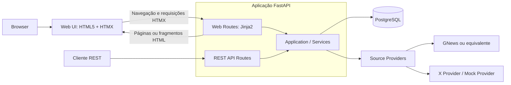
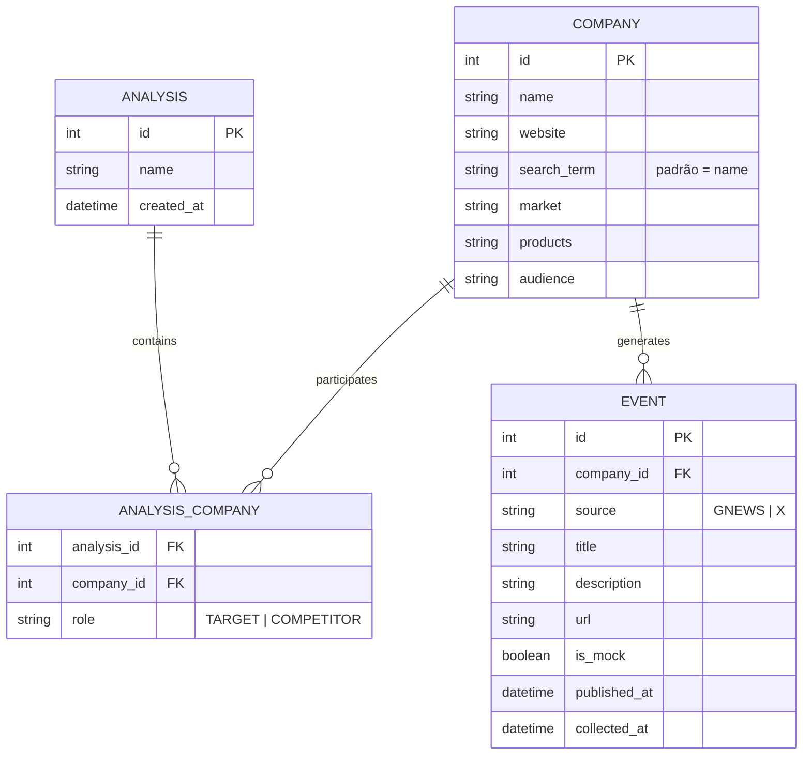
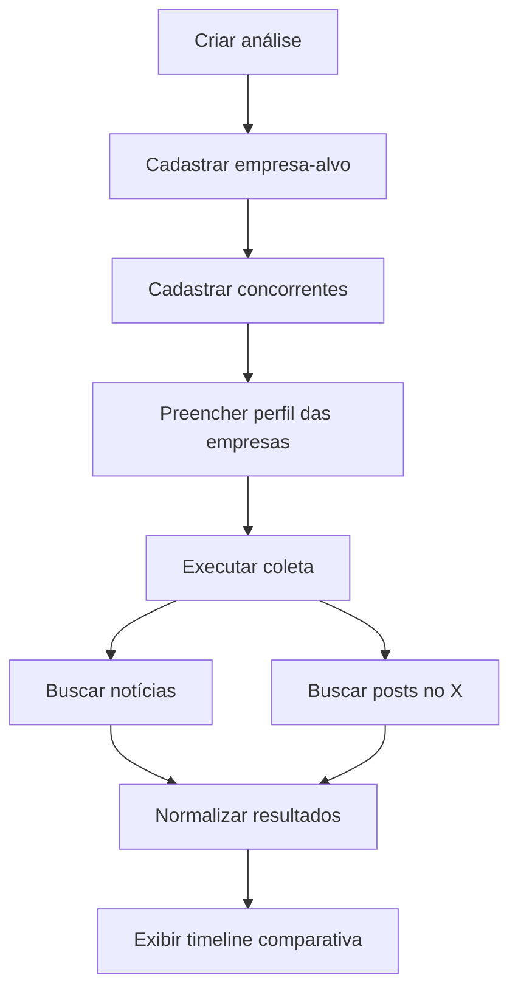
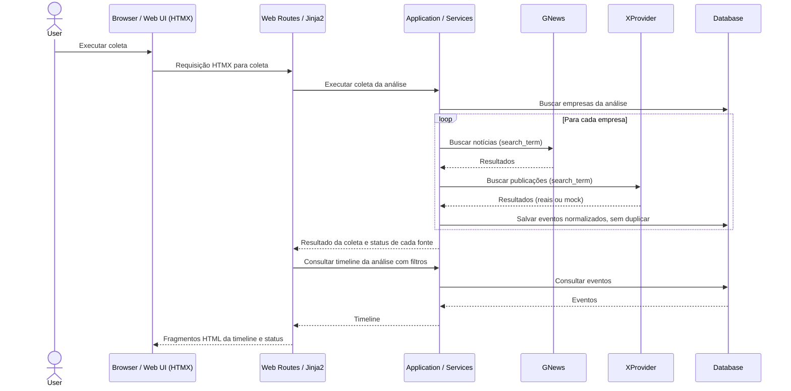

# Arquitetura do MVP — Entrega da Aula 1

Este é o documento oficial e autocontido da entrega de arquitetura da Aula 1 do **Competitive Monitor**. Consolida o escopo, os usuários, os componentes, os dados, a API, as tecnologias e os fluxos do MVP. A [proposta inicial](../competitive_monitor_mvp.md) permanece como referência complementar.
A arquitetura descrita neste documento foi implementada e validada localmente: o monólito FastAPI serve a Web UI Jinja2/HTMX e a REST API por uma camada compartilhada de serviços, com persistência PostgreSQL e providers mockados. A implementação real e seus comandos de execução estão em [backend/README.md](../backend/README.md). Providers reais e o período padrão da coleta permanecem pendentes.

## Base executável

A API expõe `GET /health` (HTTP 200, sem consultar o banco) e `GET /health/ready`
(HTTP 200 ao executar `SELECT 1`, HTTP 503 se o banco estiver indisponível).
Configuração por ambiente, documentação OpenAPI, tabelas de negócio, migrações,
testes funcionais e infraestrutura estão disponíveis. A Web UI e a coleta mockada
também foram validadas localmente. Consulte
[backend/README.md](../backend/README.md) para execução local.

O MVP permite acompanhar uma empresa-alvo e seus concorrentes em uma **timeline única** de notícias e publicações do X. Cada empresa pode ter um **perfil básico**, preenchido manualmente, que dá contexto à comparação.

## 1. Funcionalidades principais

- **Análises:** criar uma análise com nome, empresa-alvo e concorrentes informados manualmente; adicionar ou remover concorrentes depois.
- **Perfil da empresa:** preencher mercado, produtos e público-alvo de cada empresa.
- **Coleta:** buscar notícias (GNews ou equivalente) e publicações do X (API oficial ou mock), por empresa.
- **Timeline:** exibir os acontecimentos da empresa-alvo e dos concorrentes em ordem cronológica, com filtros por empresa, fonte e período.
- **Interface:** Web UI integrada ao FastAPI, com abas **Monitoramento** e **Perfil da empresa** para criar e consultar análises, manter concorrentes, editar perfil manual e termo de busca, executar coleta e consultar a timeline com filtros. Preserva navegação por teclado, foco visível, responsividade, estados de carregamento, vazio e erro, além de identificação visual clara dos eventos mockados.

## 2. Tipos de usuários e permissões

O MVP possui um único perfil funcional: **Analista**, que pode:

- Criar e consultar análises.
- Cadastrar, adicionar e remover concorrentes.
- Editar o perfil básico das empresas.
- Executar coleta.
- Visualizar e filtrar a timeline.

Esse perfil descreve quem utiliza o produto. **Autenticação, autorização e múltiplos níveis de acesso não fazem parte do MVP.** Não há entidades de usuário neste modelo.

## 3. Componentes



A interface é uma **aplicação web server-rendered pelo próprio FastAPI**, com **Jinja2** para templates HTML, **HTML5**, **Tailwind CSS** para estilização e **HTMX desde o início** para interações e atualizações parciais. JavaScript vanilla é usado apenas quando necessário. Não há aplicação frontend independente, SPA, React, Vue ou Next.js.

- **Web Routes:** recebem navegação, formulários e requisições HTMX; invocam os serviços e retornam páginas ou fragmentos HTML renderizados com Jinja2.
- **REST API Routes:** permanecem disponíveis e retornam os contratos REST definidos neste documento.
- **Application / Services:** camada compartilhada de regras de negócio, coleta e acesso à persistência, reutilizada diretamente pelas duas famílias de rotas.
- **Source Providers:** isolam as fontes externas e convertem seus resultados para eventos comuns à aplicação.

Web UI e REST API reutilizam a mesma lógica por chamadas diretas à camada de serviços. **Jinja2 e Web Routes não devem consumir a própria REST API via HTTP interno apenas para reutilizar lógica.** HTMX pode chamar Web Routes dedicadas a respostas HTML/parciais; essas rotas de apresentação não substituem nem alteram os endpoints REST oficiais.

## 4. Modelo de dados



- `Analysis` representa uma análise competitiva; `Company`, uma empresa monitorada; `AnalysisCompany`, o vínculo entre empresa e análise; e `Event`, um acontecimento coletado para uma empresa.
- Uma análise possui vínculos com empresas, uma empresa pode participar de várias análises e cada empresa pode possuir vários eventos.
- O papel `TARGET` (empresa-alvo) ou `COMPETITOR` (concorrente) fica em `AnalysisCompany.role`, pois depende da análise em que a empresa participa.
- O perfil (`market`, `products`, `audience`) fica na própria `Company`, e todos os campos são opcionais.
- Chave única `(company_id, source, url)` em `Event`, para não gravar o mesmo acontecimento duas vezes.
- `is_mock` identifica os eventos gerados pelo provider mock.

Tipos físicos e índices serão definidos na implementação do banco.

## 5. Endpoints propostos

| Método | Rota | Finalidade |
| --- | --- | --- |
| POST | `/analyses` | Criar análise com empresa-alvo e concorrentes |
| GET | `/analyses` | Listar análises |
| GET | `/analyses/{id}` | Consultar análise e suas empresas |
| POST | `/analyses/{id}/companies` | Adicionar concorrente |
| DELETE | `/analyses/{id}/companies/{companyId}` | Remover concorrente |
| PUT | `/companies/{id}` | Editar dados e perfil da empresa |
| POST | `/analyses/{id}/collect` | Executar coleta |
| GET | `/analyses/{id}/events?company=&source=&from=&to=` | Timeline com filtros |
| GET | `/companies/{id}/events` | Eventos de uma empresa |

## 6. Tecnologias sugeridas

| Área | Tecnologia ou decisão |
| --- | --- |
| Backend | Python, FastAPI e Uvicorn |
| Persistência | PostgreSQL, SQLAlchemy e Alembic |
| Comunicação | API REST preservada; Web Routes para páginas e fragmentos HTML, com serviços compartilhados |
| Frontend | Web UI server-rendered integrada ao próprio FastAPI, sem aplicação frontend independente ou SPA |
| Templates e marcação | Jinja2 e HTML5 |
| Estilização | Tailwind CSS |
| Interações | HTMX desde o início; JavaScript vanilla apenas quando necessário |
| Integrações | GNews ou provider equivalente; X Provider ou Mock Provider |
| Configuração | Variáveis de ambiente e Pydantic Settings |
| Ambiente local | Aplicação FastAPI e PostgreSQL via Docker Compose |
| Diagramas e documentação | Markdown e Mermaid |

## 7. Fluxos principais

### 7.1 Como o usuário define quem é monitorado

**Passo 1: criar a análise.** Na tela *Nova análise*, o usuário informa:

| Campo | Obrigatório | Exemplo |
| --- | :---: | --- |
| Nome da análise | ✅ | Bancos Digitais Brasil |
| Empresa-alvo (nome e site) | ✅ | Nubank, nubank.com.br |
| Concorrentes (nome e site) | ❌ | Banco Inter (inter.co), C6 Bank, PicPay |
| Termo de busca | ❌ | "Banco Inter" (evita confundir com a palavra "inter") |

Exemplo de corpo da requisição `POST /analyses`:

```json
{
  "name": "Bancos Digitais Brasil",
  "target": { "name": "Nubank", "website": "nubank.com.br" },
  "competitors": [
    { "name": "Inter", "website": "inter.co", "search_term": "Banco Inter" },
    { "name": "C6 Bank", "website": "c6bank.com.br" }
  ]
}
```

O backend cria as `Company` (reaproveitando a que já tiver o mesmo site) e os vínculos `TARGET` e `COMPETITOR`.

**Passo 2: ajustar a lista e o perfil.** O usuário pode adicionar ou remover concorrentes na aba *Monitoramento* e preencher mercado, produtos e público-alvo na aba *Perfil da empresa*.

**Passo 3: o que o sistema busca.** A coleta usa o `search_term` de cada empresa vinculada à análise, ou o nome, quando o termo não é informado. Empresas fora da lista não aparecem na timeline. O período padrão é de 7 dias, a confirmar pelo grupo.

### 7.2 Fluxo de uso



O perfil é opcional: a coleta funciona mesmo sem ele.

### 7.3 Coleta



Se uma fonte falhar, a coleta continua com as demais, e a resposta informa o status de cada fonte.

O diagrama representa o fluxo da Web UI. Clientes REST continuam utilizando `POST /analyses/{id}/collect` e `GET /analyses/{id}/events`; suas API Routes invocam os mesmos serviços diretamente e retornam os contratos REST, sem renderizar templates.

## 8. Prompts utilizados e ferramentas

O processo utilizou:

- **ChatGPT** para discovery, redução de escopo e estruturação inicial do MVP.
- **Agente de desenvolvimento utilizado no repositório** para revisão e consolidação técnica.
- **Mermaid** para os diagramas.

O registro dos prompts está em [prompts/prompt_architecture.md](../prompts/prompt_architecture.md).

## 9. Limites do MVP e critério de aceite

A empresa-alvo e os concorrentes são informados manualmente, o perfil básico é opcional e preenchido manualmente, e a coleta é acionada pelo analista. O MVP reúne notícias e publicações do X, com providers reais ou mockados, em uma timeline comparativa.

Mapa Competitivo, descoberta automática de concorrentes, geração automática de perfil, classificação de concorrentes, análise por IA, crawling completo, alertas e processamento contínuo ficam fora do MVP. Autenticação, autorização e múltiplos níveis de acesso também estão fora do escopo.

**Critério de aceite:** O MVP funcional é considerado concluído quando o analista consegue criar uma análise, informar empresa-alvo e ao menos um concorrente, executar uma coleta com providers reais ou mockados, persistir os eventos e consultar a timeline.

Os concorrentes podem ser adicionados após a criação da análise; a validação do fluxo completo exige ao menos um concorrente.

## Equipe

- Leticia
- Luane
- Luca
- Felipe
