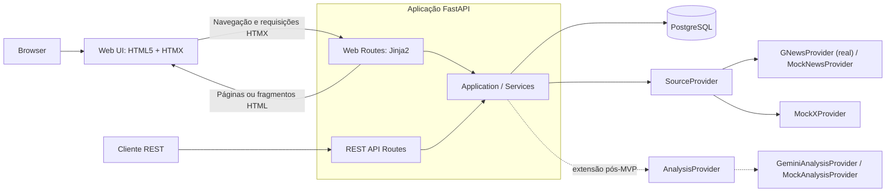
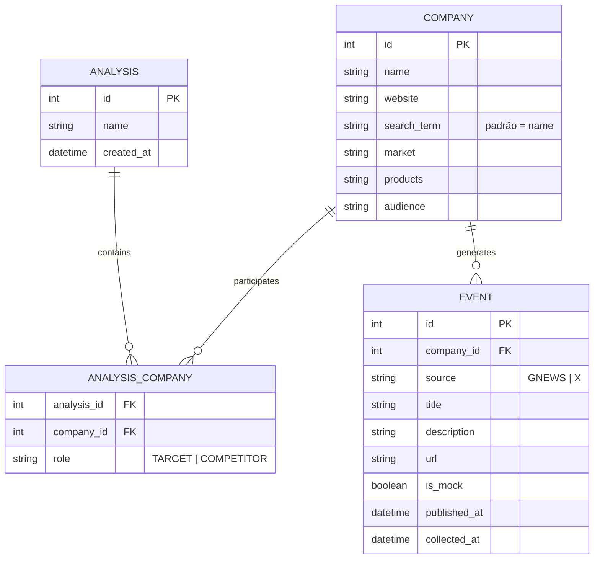
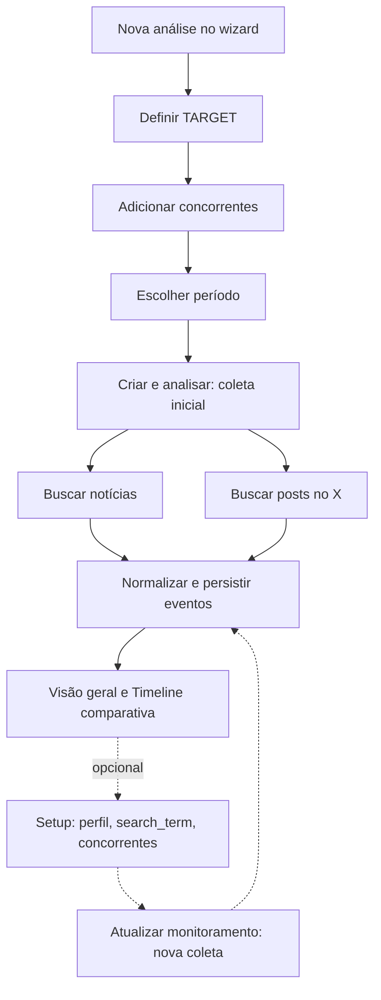
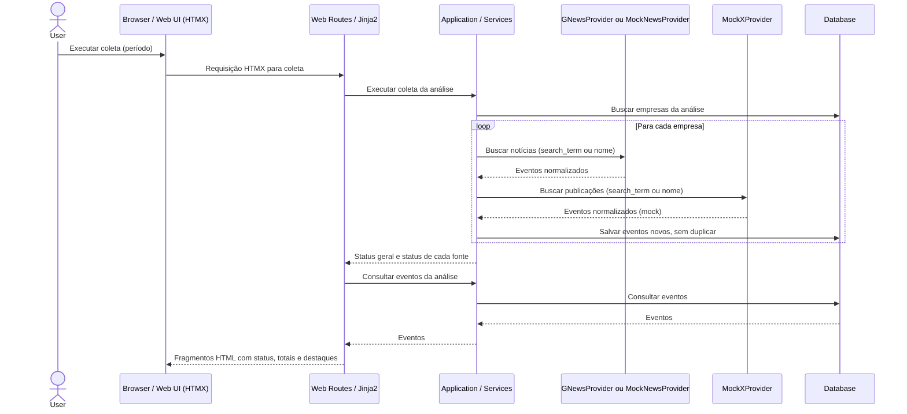
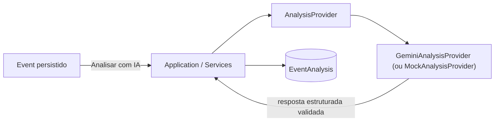
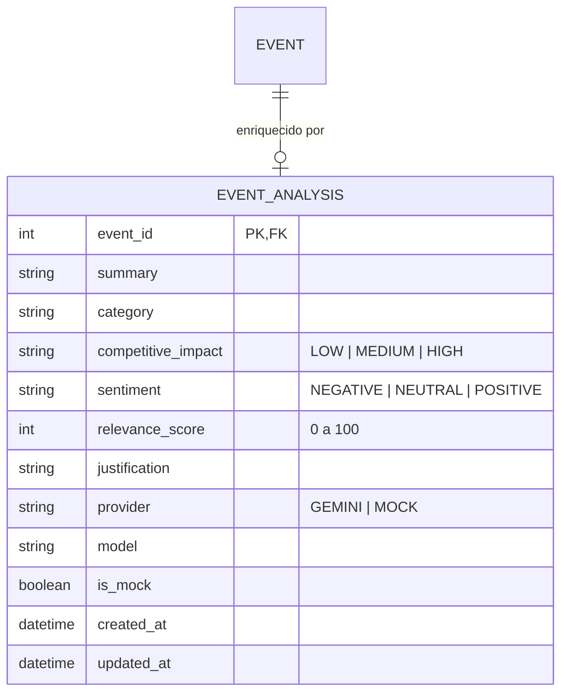

# Arquitetura do MVP — Entrega da Aula 1

Este é o documento oficial de arquitetura do **Bisb — Competitive Monitor**. Bisb é o nome do sistema/produto. Competitive Monitor é o módulo implementado e o escopo funcional desta entrega.

O documento define o escopo, os usuários, os componentes, os dados, a API, as tecnologias e os fluxos do MVP, e registra como essa arquitetura está implementada. A [proposta inicial](../competitive_monitor_mvp.md) guarda a visão do produto e o roadmap.

Ele distingue três camadas:

- **MVP base:** escopo e critério de aceite definidos na Aula 1.
- **Estado implementado:** como o MVP base foi construído no repositório, incluindo decisões que estavam em aberto na Aula 1.
- **Extensão pós-MVP:** funcionalidade implementada depois do MVP base, fora do critério de aceite original.

O MVP permite acompanhar uma empresa-alvo e seus concorrentes em uma **timeline única** de notícias e publicações do X. Cada empresa pode ter um **perfil básico** preenchido manualmente, que dá contexto à comparação.

**Hipótese:** dada uma empresa-alvo e uma lista de concorrentes definida pelo analista, é possível coletar acontecimentos de fontes diferentes, normalizá-los, persistir os resultados e apresentá-los em uma timeline comparativa.

**Estado implementado:** um monólito FastAPI serve a Web UI (Jinja2 + HTMX) e a REST API por meio de uma camada compartilhada de serviços, com persistência em PostgreSQL. As notícias vêm do GNews real quando há chave configurada, ou de um mock quando não há; as publicações do X são mockadas. A execução local está descrita em [backend/README.md](../backend/README.md).

## Base executável

A API expõe `GET /health` (HTTP 200, sem consultar o banco) e `GET /health/ready` (HTTP 200 ao executar `SELECT 1`, HTTP 503 se o banco estiver indisponível). A configuração é feita por variáveis de ambiente e estão disponíveis a documentação OpenAPI, as migrações Alembic, os testes automatizados e o ambiente Docker Compose.

## 1. Funcionalidades principais

- **Análises:** criar uma análise com nome, empresa-alvo e concorrentes informados manualmente; adicionar ou remover concorrentes depois.
- **Perfil básico:** preencher, opcionalmente, mercado, produtos e público-alvo de cada empresa, além do termo de busca (`search_term`).
- **Coleta:** acionada pelo analista para um intervalo de datas. Busca notícias no GNews (real com `GNEWS_API_KEY`, mock sem ela) e publicações do X (mock), para cada empresa da análise.
- **Timeline:** exibir os acontecimentos da empresa-alvo e dos concorrentes em ordem cronológica, com filtros por empresa, fonte e período.
- **Interface:** Web UI integrada ao FastAPI, organizada em lista de análises, wizard de criação, workspace (**Visão geral**, **Timeline**, **Empresas**) e área de **Setup**, detalhados na seção 3. Inclui navegação por teclado, foco visível, layout responsivo, estados de carregamento, vazio e erro e identificação visual dos eventos mockados.

## 2. Tipos de usuários e permissões

O MVP possui um único perfil funcional: **Analista**, que pode:

- Criar e consultar análises.
- Cadastrar, adicionar e remover concorrentes.
- Editar os dados, o perfil básico e o termo de busca das empresas.
- Executar coleta.
- Visualizar e filtrar a timeline.

Esse perfil descreve quem utiliza o produto. **Autenticação, autorização e múltiplos níveis de acesso não fazem parte do MVP.** Não há entidades de usuário neste modelo.

## 3. Componentes



A interface é uma **aplicação web server-rendered pelo próprio FastAPI**, com **Jinja2** para templates HTML, **HTML5**, **Tailwind CSS** compilado localmente e **HTMX** servido como asset local para interações e atualizações parciais. JavaScript vanilla é usado apenas quando necessário. Não há aplicação frontend independente, SPA, React, Vue ou Next.js.

- **Web Routes:** recebem navegação, formulários e requisições HTMX; invocam os serviços e retornam páginas ou fragmentos HTML renderizados com Jinja2.
- **REST API Routes:** retornam os contratos REST definidos neste documento.
- **Application / Services:** camada compartilhada de regras de negócio, coleta e acesso à persistência, reutilizada diretamente pelas duas famílias de rotas.
- **SourceProvider:** abstração das fontes de acontecimentos. Cada provider converte os resultados externos em eventos normalizados da aplicação. O GNews real é selecionado quando `GNEWS_API_KEY` está configurada; caso contrário, usa-se o mock de notícias. O X é sempre mockado.
- **AnalysisProvider (extensão pós-MVP):** abstração independente de `SourceProvider`, usada apenas no enriquecimento individual de eventos (ver a seção sobre a extensão).

Web UI e REST API reutilizam a mesma lógica por chamadas diretas à camada de serviços. **Jinja2 e Web Routes não consomem a própria REST API via HTTP interno.** HTMX chama Web Routes dedicadas a respostas HTML/parciais; essas rotas de apresentação não substituem nem alteram os endpoints REST.

### Organização da Web UI

| Área | Rota | Conteúdo |
| --- | --- | --- |
| Entrada demonstrativa | `/login` | Tela de acesso com as opções Microsoft e Google, que apenas levam à lista de análises; não há autenticação nem integração com esses provedores |
| Lista de análises | `/ui/analyses` | Análises existentes e ação **Nova análise**; `/` redireciona para cá |
| Wizard de criação | `/ui/analyses/new` | Etapas **Análise → Empresa principal / TARGET → Concorrentes → Período → Revisão**; a confirmação **Criar e analisar** cria os registros, executa a coleta inicial e abre o workspace |
| Workspace — Visão geral | `/ui/analyses/{id}?view=overview` | Contador de acontecimentos, número de empresas, distribuição de eventos por empresa, acontecimentos em destaque e formulário de coleta (**Atualizar monitoramento**) |
| Workspace — Timeline | `/ui/analyses/{id}?view=timeline` | Eventos com filtros por empresa, fonte e período, identificação de mocks, link para a fonte original e ação opcional **Analisar com IA** |
| Workspace — Empresas | `/ui/analyses/{id}?view=companies` | TARGET e concorrentes, com atalho para edição no Setup |
| Setup | `/ui/analyses/{id}/setup` | Nome da análise, adição/remoção de concorrentes, dados das empresas, perfil manual opcional e `search_term` |

Na Visão geral, os destaques são os eventos com análise Gemini existente, ordenados por relevância e data de publicação. Quando não há análise Gemini, a Visão geral mostra os eventos mais recentes. Essa tela não chama IA e não calcula scores próprios.

## 4. Modelo de dados



- `Analysis` representa uma análise competitiva; `Company`, uma empresa monitorada; `AnalysisCompany`, o vínculo entre empresa e análise; e `Event`, um acontecimento coletado para uma empresa.
- Uma análise possui vínculos com empresas, uma empresa pode participar de várias análises e cada empresa pode possuir vários eventos.
- O papel `TARGET` (empresa-alvo) ou `COMPETITOR` (concorrente) fica em `AnalysisCompany.role`, pois depende da análise em que a empresa participa. Um índice parcial garante um único `TARGET` por análise.
- O perfil (`market`, `products`, `audience`) fica na própria `Company`, e todos os campos são opcionais.
- Chave única `(company_id, source, url)` em `Event`, para não gravar o mesmo acontecimento duas vezes.
- `is_mock` identifica os eventos gerados por providers mockados.
- O período de coleta não é atributo de `Analysis`: cada coleta recebe um intervalo de datas.

Tipos físicos, índices e restrições estão definidos nos modelos SQLAlchemy e nas migrações Alembic em `backend/migrations/versions/`. A extensão pós-MVP acrescenta `EventAnalysis`, descrita na seção sobre a extensão.

## 5. Endpoints

| Método | Rota | Finalidade |
| --- | --- | --- |
| POST | `/analyses` | Criar análise com empresa-alvo e concorrentes |
| GET | `/analyses` | Listar análises |
| GET | `/analyses/{id}` | Consultar análise e suas empresas |
| POST | `/analyses/{id}/companies` | Adicionar concorrente |
| DELETE | `/analyses/{id}/companies/{companyId}` | Remover concorrente |
| PUT | `/companies/{id}` | Editar dados e perfil da empresa |
| POST | `/analyses/{id}/collect` | Executar coleta para `from_date`/`to_date` |
| GET | `/analyses/{id}/events?company=&source=&from=&to=` | Timeline com filtros |
| GET | `/companies/{id}/events` | Eventos de uma empresa |

A resposta da coleta informa o status geral (`success`, `partial` ou `failure`), os totais recebidos e persistidos e o resultado de cada par fonte/empresa. Os schemas completos ficam em `/docs` (OpenAPI).

## 6. Tecnologias adotadas

| Área | Tecnologia ou decisão |
| --- | --- |
| Backend | Python 3.14, FastAPI e Uvicorn |
| Persistência | PostgreSQL 16, SQLAlchemy síncrono e Alembic |
| Comunicação | REST API; Web Routes para páginas e fragmentos HTML, com serviços compartilhados |
| Frontend | Web UI server-rendered integrada ao próprio FastAPI, sem aplicação frontend independente ou SPA |
| Templates e marcação | Jinja2 e HTML5 |
| Estilização | Tailwind CSS compilado localmente |
| Interações | HTMX local; JavaScript vanilla apenas quando necessário |
| Notícias | GNews API quando `GNEWS_API_KEY` está configurada; mock sem a chave |
| X/Twitter | Mock X; integração real não implementada |
| Enriquecimento (extensão pós-MVP) | Gemini via SDK `google-genai`, ou mock selecionado por `ANALYSIS_PROVIDER` |
| Configuração | Variáveis de ambiente e Pydantic Settings |
| Ambiente local | Aplicação FastAPI e PostgreSQL via Docker Compose |
| Diagramas e documentação | Markdown e Mermaid |

## 7. Fluxos principais

### 7.1 Como o usuário define quem é monitorado

**Passo 1: criar a análise.** Na Web UI, o wizard **Nova análise** solicita:

| Etapa | Campo | Obrigatório | Exemplo |
| --- | --- | :---: | --- |
| Análise | Nome da análise | ✅ | Bancos Digitais Brasil |
| Empresa principal / TARGET | Nome e site | ✅ | Nubank, nubank.com.br |
| Empresa principal / TARGET | Termo de busca | ❌ | — |
| Concorrentes | Nome e site de ao menos um concorrente | ✅ no wizard | Inter (inter.co), C6 Bank, PicPay |
| Concorrentes | Termo de busca | ❌ | "Banco Inter" (evita confundir com a palavra "inter") |
| Período | 1 semana, 1 mês, 3 meses ou personalizado | ✅ | 1 semana |

A etapa **Revisão** resume os dados. **Criar e analisar** cria os registros, executa a coleta inicial no período escolhido e abre a Visão geral. Uma falha na coleta não desfaz a criação da análise.

Na REST API, a criação usa `POST /analyses` e aceita análise sem concorrentes:

```json
{
  "name": "Bancos Digitais Brasil",
  "target": { "name": "Nubank", "website": "nubank.com.br" },
  "competitors": [
    { "name": "Inter", "website": "inter.co", "search_term": "Banco Inter" },
    { "name": "C6 Bank", "website": "c6bank.com.br" }
  ]
}
```

O backend cria as `Company`, reaproveitando a que já tiver o mesmo site, e os vínculos `TARGET` e `COMPETITOR`.

**Passo 2: ajustar a lista e o perfil.** No **Setup**, o usuário renomeia a análise, adiciona ou remove concorrentes e edita nome, site, `search_term`, mercado, produtos e público-alvo de cada empresa. Como `Company` é compartilhada, a edição vale para todas as análises em que a empresa participa.

**Passo 3: o que o sistema busca.** A coleta usa o `search_term` de cada empresa vinculada à análise, ou o nome quando o termo não é informado. Empresas fora da lista não aparecem na timeline. O intervalo é escolhido a cada coleta: os presets **1 semana**, **1 mês** e **3 meses** são conveniências de interface convertidas em datas concretas, e **Personalizado** aceita datas livres. O wizard começa em 1 semana. Nenhum período fica persistido na análise, e não há regra de período padrão no domínio.

### 7.2 Fluxo de uso



O perfil é opcional: a coleta funciona mesmo sem ele.

### 7.3 Coleta



Cada par empresa/fonte é persistido de forma independente: se uma fonte falhar, a coleta continua com as demais, os eventos já salvos são preservados e a resposta informa o status de cada fonte. Se a chamada real ao GNews falhar, a coleta registra a falha e não substitui o resultado por um mock.

O diagrama representa a coleta disparada pela Visão geral. A coleta inicial do wizard usa o mesmo serviço e redireciona para o workspace. Clientes REST utilizam `POST /analyses/{id}/collect` e `GET /analyses/{id}/events`; suas API Routes invocam os mesmos serviços e retornam os contratos REST, sem renderizar templates.

## 8. Prompts utilizados e ferramentas

O processo utilizou:

- **ChatGPT** para discovery, redução de escopo e estruturação inicial do MVP.
- **Codex**, como agente de desenvolvimento no repositório, para revisão, consolidação técnica e implementação.
- **Claude Code**, como agente no repositório, para verificação de consistência entre documentação e código, correções e documentação de entrega.
- **Mermaid** para os diagramas.

O registro dos prompts da arquitetura está em [prompts/prompt_architecture.md](../prompts/prompt_architecture.md). Os prompts da Aula 2 estão em [prompts/context-generation.md](../prompts/context-generation.md), que gera o contexto operacional `.ai/`, e em [prompts/implementation.md](../prompts/implementation.md), que orienta a implementação. Esses arquivos são registros históricos das interações e não descrevem as extensões posteriores.

## 9. Limites do MVP e critério de aceite

A empresa-alvo e os concorrentes são informados manualmente, o perfil básico é opcional e preenchido manualmente, e a coleta é acionada pelo analista. O MVP reúne notícias e publicações do X, com providers reais ou mockados, em uma timeline comparativa.

Mapa Competitivo, descoberta automática de concorrentes, geração automática de perfil, classificação de concorrentes, análise por IA, crawling completo, alertas e processamento contínuo ficam fora do MVP base. Autenticação, autorização e múltiplos níveis de acesso também estão fora do escopo. A análise individual de eventos por IA foi implementada depois, como extensão opcional (seção a seguir), sem alterar este critério.

**Critério de aceite:** o MVP funcional é considerado concluído quando o analista consegue criar uma análise, informar empresa-alvo e ao menos um concorrente, executar uma coleta com providers reais ou mockados, persistir os eventos e consultar a timeline.

Na REST API, os concorrentes podem ser adicionados após a criação da análise; a validação do fluxo completo exige ao menos um concorrente, e o wizard da Web UI só conclui a criação com um concorrente informado.

## 10. Decisões consolidadas na implementação

| Tema em aberto na Aula 1 | Decisão implementada |
| --- | --- |
| Provider de notícias | GNews API, selecionado por `GNEWS_API_KEY`. O termo é enviado como frase exata (`q="Mercado Pago"`), com `in=title,description`, `sortby=publishedAt` e o intervalo da coleta. A chave vai no header `X-Api-Key`. Sem chave, usa-se o mock de notícias |
| X/Twitter | Mock X; a integração real não foi implementada |
| Período da coleta | Informado a cada coleta. A Web UI oferece presets de conveniência; não há período persistido nem padrão de domínio |
| Resposta da coleta | Status geral `success`/`partial`/`failure` e resultado por fonte/empresa |
| Interface | Wizard de criação, workspace com Visão geral, Timeline e Empresas, e Setup separado |

## Extensão opcional pós-MVP — análise de eventos por IA

A análise por IA ficou fora do escopo original da Aula 1 e do critério de aceite acima. Ela foi implementada depois, como extensão opcional, para enriquecer individualmente um `Event` já persistido. A integração com Gemini foi validada em execução real. A análise não avalia o evento em relação a um TARGET específico, não é executada durante a coleta e não é necessária para o funcionamento da timeline.





`EventAnalysis` é uma entidade 1:1 separada de `Event`, de modo que o dado coletado nunca é alterado. Categorias: `PRODUCT`, `PRICING`, `PARTNERSHIP`, `EXPANSION`, `FINANCIAL_RESULTS`, `REGULATORY`, `M_AND_A`, `PEOPLE`, `TECHNOLOGY`, `OTHER`. O impacto representa intensidade, sem direção.

O provider é escolhido explicitamente por `ANALYSIS_PROVIDER` (`gemini` ou `mock`). Gemini usa `GEMINI_API_KEY` e `GEMINI_MODEL`, com saída estruturada validada por schema Pydantic. O prompt recebe apenas empresa, fonte, data, título e descrição do evento, e a resposta bruta não é persistida.

Comportamento da análise:

- é disparada por ação explícita do usuário, um evento por vez, de forma síncrona;
- não roda durante a coleta, de forma automática, em lote ou em background;
- reutiliza o resultado existente; **Reanalisar** (`force=true`) solicita uma nova chamada;
- sem chave, com erro de rede ou com resposta inválida, retorna erro controlado sem criar resultado simulado;
- quando uma reanálise falha, a análise anterior é preservada;
- `ANALYSIS_PROVIDER=mock` produz um resultado determinístico identificado como simulado.

Endpoints adicionais desta extensão:

| Método | Rota | Finalidade |
| --- | --- | --- |
| POST | `/events/{event_id}/analysis?force=false` | Criar análise ou reutilizar a existente; `force=true` solicita reanálise explícita |
| GET | `/events/{event_id}/analysis` | Consultar resultado persistido |

Na Web UI, a ação **Analisar com IA** fica em cada evento da Timeline. O resultado aparece em uma área recolhível associada ao evento, identificada como **Análise Gemini** ou **Análise simulada**. A Visão geral usa a relevância das análises Gemini existentes para escolher os destaques. A extensão não altera os endpoints nem o critério de aceite originais.

## Equipe

- Leticia
- Luane
- Luca
- Felipe
