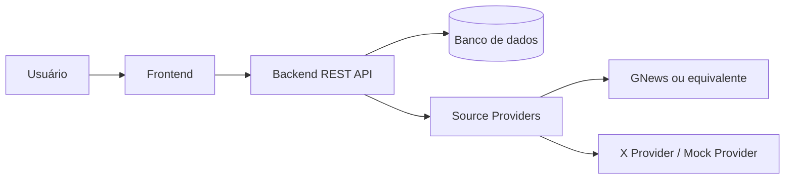
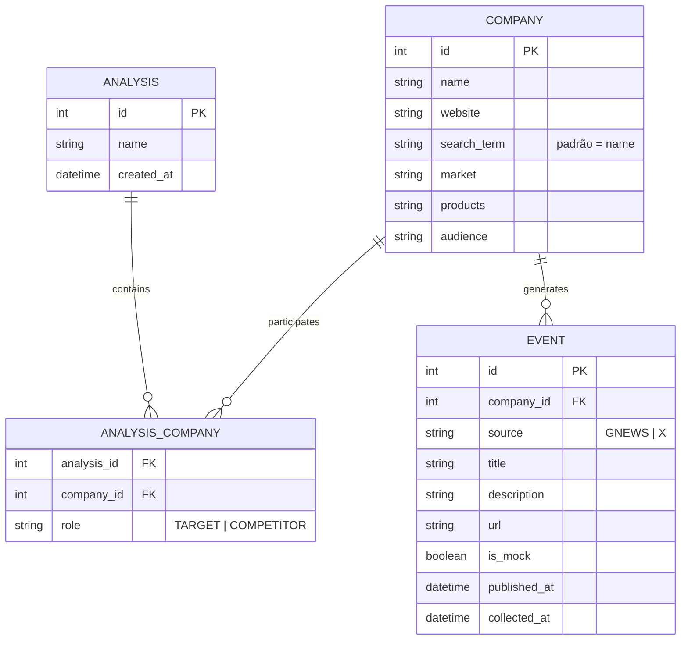
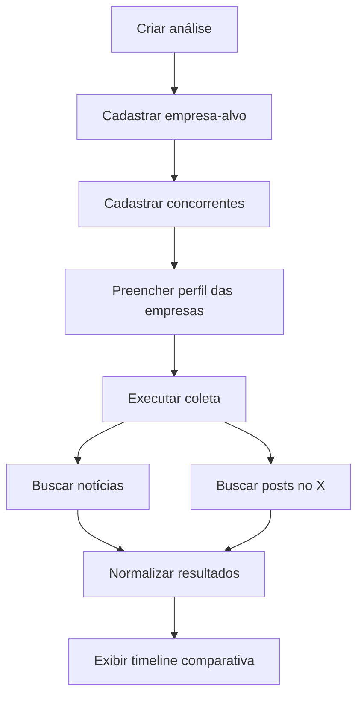
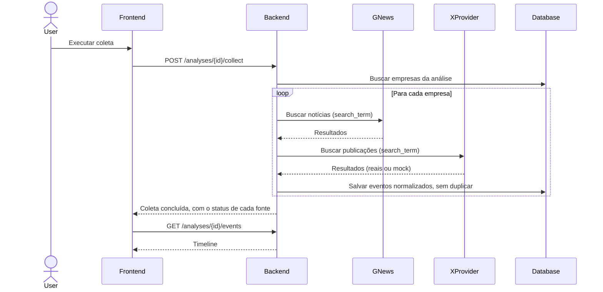

# Arquitetura do MVP

Este documento consolida a arquitetura do MVP proposta em [competitive_monitor_mvp.md](../competitive_monitor_mvp.md). Representa o planejamento; os componentes ainda não estão implementados.

O MVP permite acompanhar uma empresa-alvo e seus concorrentes em uma **timeline única** de notícias e publicações do X. Cada empresa pode ter um **perfil básico**, preenchido manualmente, que dá contexto à comparação.

## 1. Funcionalidades principais

- **Análises:** criar uma análise com nome, empresa-alvo e concorrentes informados manualmente; adicionar ou remover concorrentes depois.
- **Perfil da empresa:** preencher mercado, produtos e público-alvo de cada empresa.
- **Coleta:** buscar notícias (GNews ou equivalente) e publicações do X (API oficial ou mock), por empresa.
- **Timeline:** exibir os acontecimentos da empresa-alvo e dos concorrentes em ordem cronológica, com filtros por empresa, fonte e período.
- **Interface:** abas **Monitoramento** e **Perfil da empresa**, navegação por teclado, foco visível e layout responsivo, com estados de carregamento, lista vazia e erro de coleta.

## 2. Tipos de usuários e permissões

| Ação | Analista | Leitor |
| --- | :---: | :---: |
| Criar análises e cadastrar ou remover concorrentes | ✅ | ❌ |
| Editar o perfil das empresas | ✅ | ❌ |
| Executar coleta | ✅ | ❌ |
| Visualizar timeline e perfis | ✅ | ✅ |

## 3. Componentes



O frontend apresenta as análises, o perfil e a timeline. O backend concentra as regras de negócio, a persistência e a coleta. Os providers isolam o acesso às fontes e convertem os resultados para eventos comuns à aplicação.

## 4. Modelo de dados



- O papel `TARGET` ou `COMPETITOR` fica em `AnalysisCompany`, como na seção 7 da proposta.
- O perfil (`market`, `products`, `audience`) fica na própria `Company`, e todos os campos são opcionais.
- Chave única `(company_id, source, url)` em `Event`, para não gravar o mesmo acontecimento duas vezes.
- `is_mock` identifica os eventos gerados pelo provider mock.

Tipos físicos e índices serão definidos na implementação do banco.

## 5. Endpoints propostos

| Método | Rota | Finalidade |
| --- | --- | --- |
| POST | `/analyses` | Criar análise com empresa-alvo e concorrentes |
| GET | `/analyses` | Listar análises |
| GET | `/analyses/{id}` | Consultar análise e suas empresas |
| POST | `/analyses/{id}/companies` | Adicionar concorrente |
| DELETE | `/analyses/{id}/companies/{companyId}` | Remover concorrente |
| PUT | `/companies/{id}` | Editar dados e perfil da empresa |
| POST | `/analyses/{id}/collect` | Executar coleta |
| GET | `/analyses/{id}/events?company=&source=&from=&to=` | Timeline com filtros |
| GET | `/companies/{id}/events` | Eventos de uma empresa |

## 7. Fluxos principais

### 7.1 Como o usuário define quem é monitorado

**Passo 1: criar a análise.** Na tela *Nova análise*, o usuário informa:

| Campo | Obrigatório | Exemplo |
| --- | :---: | --- |
| Nome da análise | ✅ | Bancos Digitais Brasil |
| Empresa-alvo (nome e site) | ✅ | Nubank, nubank.com.br |
| Concorrentes (nome e site) | ❌ | Banco Inter (inter.co), C6 Bank, PicPay |
| Termo de busca | ❌ | "Banco Inter" (evita confundir com a palavra "inter") |

```json
POST /analyses
{
  "name": "Bancos Digitais Brasil",
  "target": { "name": "Nubank", "website": "nubank.com.br" },
  "competitors": [
    { "name": "Inter", "website": "inter.co", "search_term": "Banco Inter" },
    { "name": "C6 Bank", "website": "c6bank.com.br" }
  ]
}
```

O backend cria as `Company` (reaproveitando a que já tiver o mesmo site) e os vínculos `TARGET` e `COMPETITOR`.

**Passo 2: ajustar a lista e o perfil.** O usuário pode adicionar ou remover concorrentes na aba *Monitoramento* e preencher mercado, produtos e público-alvo na aba *Perfil da empresa*.

**Passo 3: o que o sistema busca.** A coleta usa o `search_term` de cada empresa vinculada à análise, ou o nome, quando o termo não é informado. Empresas fora da lista não aparecem na timeline. O período padrão é de 7 dias, a confirmar pelo grupo.

### 7.2 Fluxo de uso



O perfil é opcional: a coleta funciona mesmo sem ele.

### 7.3 Coleta



Se uma fonte falhar, a coleta continua com as demais, e a resposta informa o status de cada fonte.

## 8. Limites do MVP

Os concorrentes são informados manualmente e a coleta é acionada pelo usuário. Geração automática do perfil, descoberta e classificação de concorrentes, análise por IA, alertas e processamento contínuo ficam fora do MVP, conforme a seção 4 da proposta.

## 9. Prompts utilizados

Ferramentas: **Claude Code** (Claude Opus 5.5) para a revisão e consolidação desta arquitetura e **Mermaid** para os diagramas. Os prompts de cada etapa, a partir do estado inicial do repositório, estão em [prompts/architecture.md](../prompts/architecture.md).
