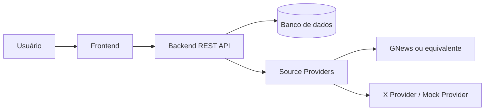
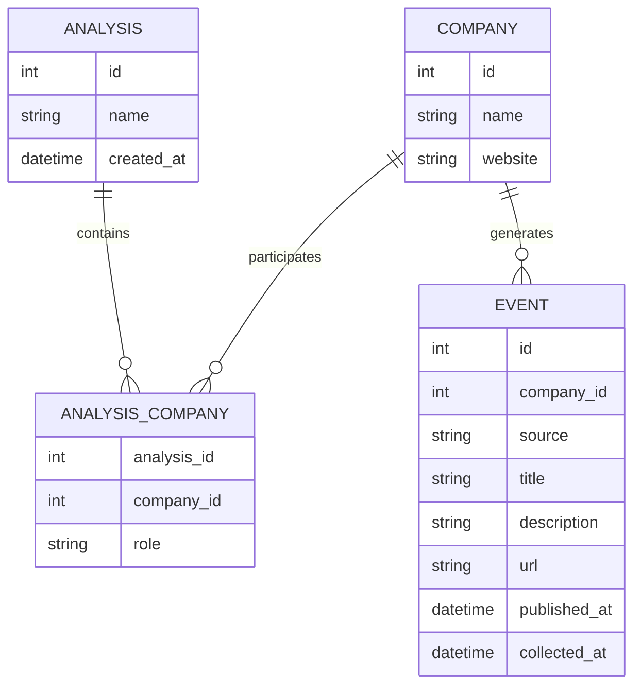

# Arquitetura inicial

Este documento consolida a arquitetura proposta em [competitive_monitor_mvp.md](../competitive_monitor_mvp.md). Representa o planejamento do MVP; os componentes ainda não estão implementados.

## Componentes

O frontend apresenta as análises e a timeline. O backend concentra as regras de negócio, a persistência e a coleta. Os providers isolam o acesso às fontes e convertem seus resultados para eventos comuns à aplicação.

## Modelo inicial

O papel `TARGET` ou `COMPETITOR` fica em `AnalysisCompany`, seguindo a seção 7 da proposta. As fontes inicialmente previstas são `GNEWS` e `X`. Tipos físicos, restrições e índices serão definidos na implementação do banco.

## Endpoints propostos

| Método | Rota | Finalidade |
| --- | --- | --- |
| POST | `/analyses` | Criar análise |
| GET | `/analyses` | Listar análises |
| GET | `/analyses/{id}` | Consultar análise |
| POST | `/analyses/{id}/companies` | Cadastrar/vincular empresa à análise |
| GET | `/analyses/{id}/companies` | Listar empresas da análise |
| POST | `/analyses/{id}/collect` | Executar coleta |
| GET | `/analyses/{id}/events` | Consultar timeline da análise |
| GET | `/companies/{id}/events` | Consultar eventos da empresa |

Os corpos de requisição, respostas, erros e parâmetros de filtro ainda precisam ser definidos.

## Fluxo de coleta

1. O usuário aciona a coleta de uma análise.
2. O backend consulta as empresas vinculadas.
3. Para cada empresa, consulta os providers de notícias e X/mock.
4. Normaliza e persiste os eventos recebidos.
5. O frontend consulta os eventos da análise e apresenta a timeline.

## Limites e decisões pendentes

O MVP utiliza concorrentes informados manualmente e coleta acionada pelo usuário. Descoberta automática, classificação por IA, alertas e processamento contínuo pertencem ao roadmap futuro.

A stack está registrada em [.ai/tech-stack.md](../.ai/tech-stack.md). Contratos da API, tratamento de falhas parciais e eventos repetidos serão detalhados durante a implementação.
